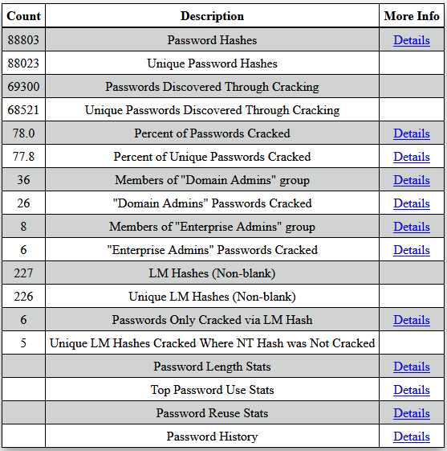

# Domain Password Audit Tool (DPAT)

This is a python script that will generate password use statistics from password hashes dumped from a domain controller and a password crack file such as oclHashcat.pot generated from the oclHashcat tool during password cracking. The report is an HTML report with clickable links.





If you would like to click through an example report you can do so [here](http://dpat.website).

You can run the python script at follows.

```sh
dpat.py -n customer.ntds -c oclHashcat.pot -g "Domain Admins.txt" "Enterprise Admins.txt"
```
Note that the group lists at the end (-g "Domain Admins.txt "Enterprise Admins.txt") are optional. Try this out on the example files provied in the sample_data folder of this project. The sample data was built from census data for common first and last names and passwords from the well known rockyou list.

Your customer.ntds file should be in this format:
> domain\username:RID:lmhash:nthash:::

You can get this file by first dumping the password hashes from your domain controller by executing the following command in an administrative command prompt on a domain controller. Just make sure you have enough disk space to store the output in c:\temp. The amount of space needed will be slightly larger than the size of the ntds.dit file that is currently on the disk, as this performs a backup of that file and some registry settings.

```sh
ntdsutil "ac in ntds" "ifm" "cr fu c:\temp" q q
```

You can then turn this output into the needed format using [secretsdump.py](https://github.com/CoreSecurity/impacket/blob/master/examples/secretsdump.py)


```sh
secretsdump.py -system registry/SYSTEM -ntds Active\ Directory/ntds.dit LOCAL -outputfile customer
```

The command above will create a file called "customer.ntds" which you will use with this tool as well as for password cracking.

Your oclHashcat file should be in this format:
>nthash:password

Or for LM Hashes:
>lmhashLeftOrRight:leftOrRightHalfPasswordUpcased

The DPAT tool also supports output from John the Ripper (same format as oclHashcat.pot but prepened with $NT$ or $LM$)

The optional "-g" option is followed by a list of any number of files containing lists of users who are in the given group such as "Enterprise Admins" or "Domain Admins". The file can be in the format output by the [PowerView PowerShell script](https://github.com/PowerShellMafia/PowerSploit/tree/master/Recon) as shown in the example below:

```sh
Get-NetGroupMember -GroupName "Domain Admins" > "Domain Admins.txt"
```

or to read a group from another domain use something like the following (note that name of the other domain and the domain controller can be obtained with Get-NetForestDomain)

```sh
Get-NetGroupMember -GroupName "Enterprise Admins" -Domain "some.domain.com" -DomainController "DC01.some.domain.com" > "Enterprise Admins.txt"
```
Alternatively, the group files can simply be a list of users, one per line, in the following format:

>domain\username

The Domain Password Audit Tool also has the handy feature to finish cracking the LM hashes for any hashes where the NT hash was not cracked. This asssumes that you have used oclHashcat to brute force all 7 character passwords with the following command:

```sh
./oclHashcat64.bin -m 3000 -a 3 customer.ntds -1 ?a ?1?1?1?1?1?1?1 --increment
```

Or to crack LM hashes with John the Ripper instead:

```sh
john --format=LM customer.ntds
```

To see all available DPAT options use the '-h' or '--help' option

```sh
usage: dpat.py [-h] -n NTDSFILE -c CRACKFILE [-o OUTPUTFILE]
               [-d REPORTDIRECTORY] [-w] [-s]
               [-g [GROUPLISTS [GROUPLISTS ...]]]

This script will perfrom a domain password audit based on an extracted NTDS
file and password cracking output such as oclHashcat.

optional arguments:
  -h, --help            show this help message and exit
  -n NTDSFILE, --ntdsfile NTDSFILE
                        NTDS file name (output from SecretsDump.py)
  -c CRACKFILE, --crackfile CRACKFILE
                        Password Cracking output in the default form output by
                        oclHashcat, such as oclHashcat.pot
  -o OUTPUTFILE, --outputfile OUTPUTFILE
                        The name of the HTML report output file, defaults to
                        _DomainPasswordAuditReport.html
  -d REPORTDIRECTORY, --reportdirectory REPORTDIRECTORY
                        Folder containing the output HTML files, defaults to
                        DPAT Report
  -w, --writedb         Write the SQLite database info to disk for offline
                        inspection instead of just in memory. Filename will be
                        "pass_audit.db"
  -s, --sanitize        Sanitize the report by partially redacting passwords
                        and hashes. Prepends the report directory with
                        "Sanitized - "
  -g [GROUPLISTS [GROUPLISTS ...]], --grouplists [GROUPLISTS [GROUPLISTS ...]]
                        The name of one or multiple files that contain lists
                        of usernames in particular groups. The group names
                        will be taken from the file name itself. The username
                        list must be in the same format as found in the NTDS
                        file such as some.ad.domain.com\username. Example: -g
                        "Domain Admins.txt" "Enterprise Admins.txt"
```

## Sponsors

[](http://www.blackhillsinfosec.com)
